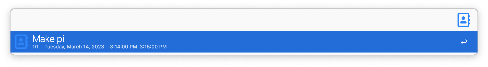

# fetch Meeting Details
A workflow to grab event details from your Outlook calendar. Set the time interval in `Workflow configuration`, e.g: 0 will show concurrent events, 10 events that will be concurrent in 10 min etc. 

Actioning an event will copy to clipoboard in Markdown format

# Thank you
Icon: [https://font2png.com/](https://font2png.com/)
